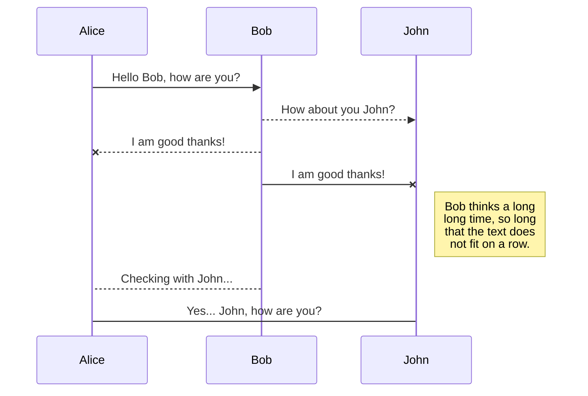
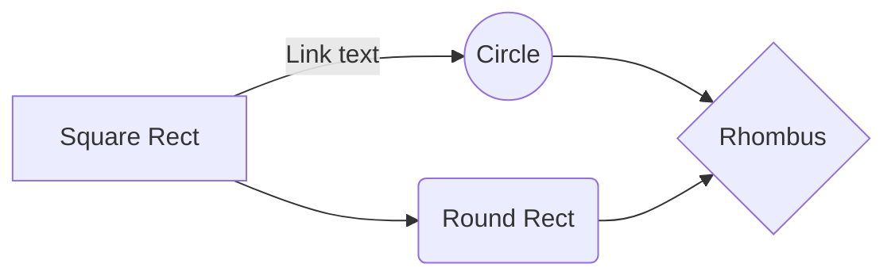

# Welcome to Fract'ol!

This project is an introduction to graphic programming in **C** @42 
It uses a simple homemade graphic library called **MinilibX**
The goal is to compute and render simple 2D Fractales like Mandelbrot or Julia, learn to optimize basic calculus in C with float and introduce you to recurrent issues coming with such type of projects (Large amount of recurrent computation). You're also engage to implement basic multi-threading, color palettes and user input actions.

## How to run

To run this program :

- Clone this repository  `git clone https://github.com/Nrechati/Fract-ol.git`
- Make sure you have `mlx` graphic library installed on your computer
- Just `Make`
>**Note** : Sources for MinilibX can be found in this repository as well

## Core feature

This program will compute and display **three types of Fractal** 

-  *Mandelbrot set*	[https://fr.wikipedia.org/wiki/Ensemble_de_Mandelbrot](https://fr.wikipedia.org/wiki/Ensemble_de_Mandelbrot)
- *Julia set* [https://fr.wikipedia.org/wiki/Ensemble_de_Julia](https://fr.wikipedia.org/wiki/Ensemble_de_Julia)
- *Burning ship set* [https://fr.wikipedia.org/wiki/Fractale_burning_ship](https://fr.wikipedia.org/wiki/Fractale_burning_ship)

The program will also offer **3 different color** gradients for a nicer display 
And basic **user input keys**, **features** and **usage** to interact with it

> See `fractol_subject.pdf` in directory for full details of expected behavior and feature

## Additional Features

In addition to core feature *(i.e mandatory part of the subject)*, few features have been added such as :

- Basic **Multi-Threading** via `pthread`,  splitting the window according to `THREAD` define value 
- **Menu** displaying allowed user **input**  and optional **Zoom** and **Iterations** values
-  Modify **iterations** count
- **Switching** live between **Fractales**
- **Modifying and Freezing Julia's zero value** based on cursor x/y
- **Reseting** view

## Usage and Key-bind

This section will explain how to use the program *(note that all key-binds also appear in the menu inside the window)*

### Usage
`Usage: ./Fractol [fractal_name]`
`Possible choices:`
`	. -h [help]`
`	. Mandelbrot`
`	. Julia`
`	. BurningShip`
> **Note** : Name input is NOT case sensitive

### Key-Binds

- `Spacebar` to switch between color gradient

## Optimization

You can rename the current file by clicking the file name in the navigation bar or by clicking the **Rename** button in the file explorer.

## Further ideas

You can delete the current file by clicking the **Remove** button in the file explorer. The file will be moved into the **Trash** folder and automatically deleted after 7 days of inactivity.

## Disclaimer

You can delete the current file by clicking the **Remove** button in the file explorer. The file will be moved into the **Trash** folder and automatically deleted after 7 days of inactivity.

## Credits

You can export the current file by clicking **Export to disk** in the menu. You can choose to export the file as plain Markdown, as HTML using a Handlebars template or as a PDF.

> [https://randomascii.wordpress.com/2011/08/13/faster-fractals-through-algebra/](https://randomascii.wordpress.com/2011/08/13/faster-fractals-through-algebra/)

# Markdown extensions

StackEdit extends the standard Markdown syntax by adding extra **Markdown extensions**, providing you with some nice features.

> **ProTip:** You can disable any **Markdown extension** in the **File properties** dialog.

## SmartyPants

SmartyPants converts ASCII punctuation characters into "smart" typographic punctuation HTML entities. For example:

|                |ASCII                          |HTML                         |
|----------------|-------------------------------|-----------------------------|
|Single backticks|`'Isn't this fun?'`            |'Isn't this fun?'            |
|Quotes          |`"Isn't this fun?"`            |"Isn't this fun?"            |
|Dashes          |`-- is en-dash, --- is em-dash`|-- is en-dash, --- is em-dash|

## UML diagrams

You can render UML diagrams using [Mermaid](https://mermaidjs.github.io/). For example, this will produce a sequence diagram:

And this will produce a flow chart:

