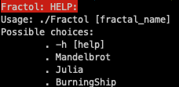
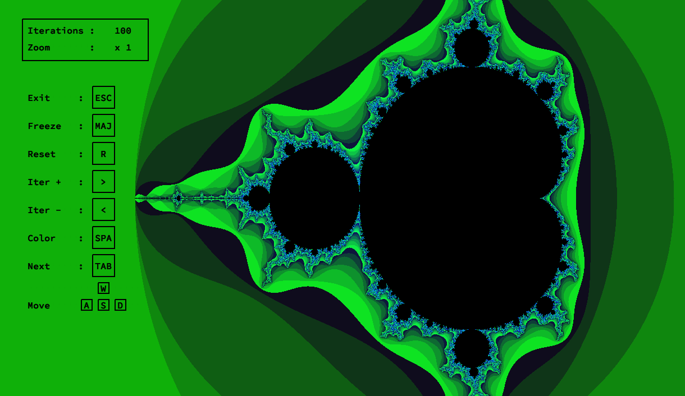
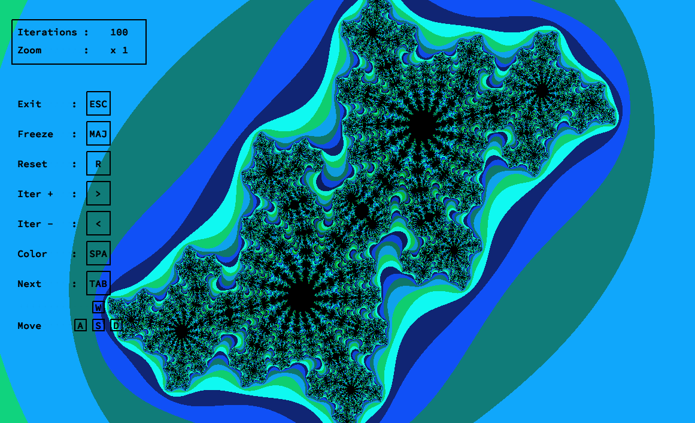
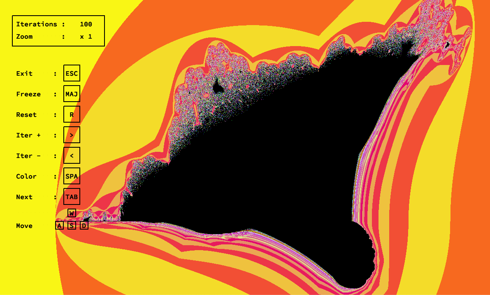

# Welcome to Fract'ol

This project is an introduction to graphic programming in **C** @42 
It uses a simple homemade graphic library called **MinilibX**
The goal is to compute and render simple 2D Fractales like Mandelbrot or Julia, learn to optimize basic calculus in C with float and introduce you to recurrent issues coming with such type of projects (Large amount of recurrent computation). You're also engage to implement basic multi-threading, color palettes and user input actions.

## How to run

To run this program :

- Clone this repository  `git clone https://github.com/Nrechati/Fract-ol.git`
- Make sure you have `mlx` graphic library installed on your computer
- Just `Make`
>**Note** : Sources for MinilibX can be found in this repository as well

## Core feature

This program will compute and display **three types of Fractal** 

-  [Mandelbrot set](https://fr.wikipedia.org/wiki/Ensemble_de_Mandelbrot)
- [Julia set](https://fr.wikipedia.org/wiki/Ensemble_de_Julia)
- [Burning ship set](https://fr.wikipedia.org/wiki/Fractale_burning_ship)

The program will also offer **3 different color** gradients for a nicer display 
And basic **user input keys**, **features** and **usage** to interact with it

> See `fractol_subject.pdf` in directory for full details of expected behavior and feature

## Additional Features

In addition to core feature *(i.e mandatory part of the subject)*, few features have been added such as :

- Basic **Multi-Threading** via `pthread`,  splitting the window according to `THREAD` define value 
- **Menu** displaying allowed user **input**  and optional **Zoom** and **Iterations** values
-  Modify **iterations** count
- **Switching** live between **Fractales**
- **Modifying and Freezing Julia's zero value** based on cursor x/y
- **Reseting** view

## Usage and Key-bind

This section will explain how to use the program *(note that all key-binds also appear in the menu inside the window)*

### Usage

> **Note** : Name input is NOT case sensitive

### Key-Binds

- `Spacebar` to switch between color gradient
- `Escape` to exit program
- `Shift` to Freeze Julia
- `>` and `<` to increase/decrease iterations count
- `Tab` to switch between fractales
- `wasd` to move
- `Ctrl` to trigger Zoom and Iterations menu
- `Option` to trigger zoom reticule
- `Command` to switch menu color 

## Fractals

### Mandelbrot

 

### Julia

where the zero value is defined by mouse cursor x and y

### Burning Ship

## Optimization

### Multi-Threading
In this program there is a basic multi-threading implementation. As each pixel is responsible for his own computation we can easily split the window according to the number of thread. Per default 8 thread are set as I worked on a Quad-Core CPU. So each logical core is responsible for a 8th of the rendering

### Computing
As a lot of computing is required to render those fractal, optimizing number of simple calculation in each pixel create a lot of space for optimization. The main idea is to store recurrent result such as square roots and square in complex number and reuse them.

I used a lot of Bruce Dawson's work to optimize mine at [Blog here](https://randomascii.wordpress.com/2011/08/13/faster-fractals-through-algebra/)

## Disclaimer

This project was done in a **single week** and is one of my **early C project @42 Paris**. In particular regarding graphic computing. But it is also one of the first I was proud to show so I decided to keep it public. I know a lot a this **C implementation could be nicer,** more optimize, and a lot of feature could have been added. **So just keep in mind this is an early student work**.

> **Note** : Program was built on MacOS Mojave and I know there is some workaround to do to compile on Linux as well (*mostly for mlx to work*)
